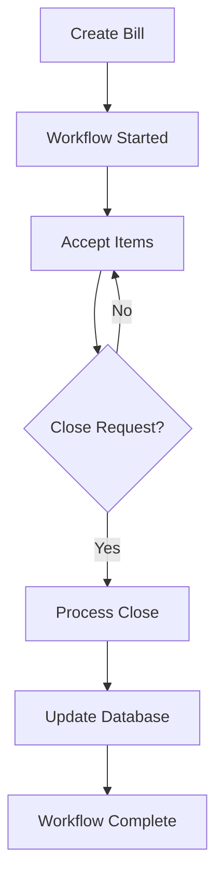

# Billing Service with Temporal Workflows

A robust billing service built with Encore.dev and Temporal.io that manages bill lifecycle through durable workflows. The service supports adding items to bills, closing bills with currency conversion, and provides real-time bill status queries.

## 🏗️ Architecture

This service uses:
- **Encore.dev** - Backend framework with built-in infrastructure
- **Temporal.io** - Workflow orchestration for reliable bill processing
- **PostgreSQL** - Persistent data storage
- **Go** - Programming language

## 📋 Prerequisites

Before running this service, ensure you have:

- **Go 1.25+** - [Install Go](https://golang.org/doc/install)
- **Encore CLI** - [Install Encore](https://encore.dev/docs/install)
- **Temporal** [Install Temporal](https://learn.temporal.io/getting_started/#set-up-your-development-environment)
- **Docker** - For running Temporal server
- **PostgreSQL** - Database (managed by Encore in development)

## 🚀 Quick Start

### 1. Clone and Setup

```bash
git clone <repository-url>
cd encore-temporal
```

### 2. Install Dependencies

```bash
# Install Encore CLI (if not already installed)
curl -L https://encore.dev/install.sh | bash

# Install Go dependencies
go mod tidy
```

### 3. Start Temporal Server

The service requires a running Temporal server. Start it using Docker:

```bash
# Start Temporal server with Docker Compose
docker run -p 7233:7233 -p 8080:8080 temporalio/auto-setup:latest
```

Or use the Temporal CLI:

```bash
# Install Temporal CLI
curl -sSf https://temporal.download/cli.sh | sh

# Start Temporal server
temporal server start-dev
```

### 4. Start the Service

```bash
# Start the Encore development server
# Ensure that docker daemon is running.
encore run
```

The service will be available at:
- **API**: `http://localhost:4000`
- **Encore Dashboard**: `http://localhost:9400`

### 5. Start the Worker

Worker for temporal are initialized at `billing/service.go` inside the `initService` function.
The `initService` function is part of Encore and will run automatically.

### 6. Generate API Spec (OpenAPI)

You can generate the OpenAPI specification for the billing APIs with:

```bash
encore gen client -e local -l OpenAPI -o APISpec.yaml
```

This will produce a YAML file (APISpec.yaml) containing the full API definitions, ready for documentation or client generation.

## 🔧 Configuration

### Environment Variables

The service uses Encore's built-in configuration. No additional environment variables are required for development.

### Database

Encore automatically manages the PostgreSQL database in development. The database schema is defined in `billing/migrations/1_create_table.up.sql`.

### Temporal Configuration

The service connects to Temporal using default settings:
- **Host**: `localhost:7233`
- **Namespace**: `default`
- **Task Queue**: `billing-task-queue`

## 🧪 Testing

### Run All Tests

```bash
# Prepare mocks
./scripts/prepare_mock.sh

# Run the test script
encore test ./... -cover -v
```
## 🏛️ Database Schema

### Tables

#### `bills`
- `id` - Primary key
- `billing_id` - Unique bill identifier
- `status` - Bill status (OPEN/CLOSED)
- `currency` - Base currency (USD/GEL)
- `total` - Total amount in smallest currency unit
- `created_at` - Creation timestamp
- `closed_at` - Closure timestamp

#### `bill_items`
- `id` - Primary key
- `bill_id` - Foreign key to bills
- `name` - Item name
- `price` - Item price in smallest currency unit
- `idemp_key` - Idempotency key for duplicate prevention

#### `bill_exchanges`
- `id` - Primary key
- `bill_id` - Foreign key to bills
- `base_currency` - Original currency
- `target_currency` - Converted currency
- `rate` - Exchange rate
- `total` - Converted amount
- `created_at` - Conversion timestamp

## 🔄 Workflow Lifecycle

### Bill States

1. **OPEN** - Bill is active, can accept items
2. **CLOSED** - Bill is finalized, no more operations allowed

### Workflow Process



### Signal Handling

- **ADD_LINE_ITEM** - Adds new item to bill
- **CLOSE_BILL** - Initiates bill closure
- **getBill** - Query current bill state

## 🛠️ Development

### Adding New Features

1. **New API Endpoints** - Add to `billing/service.go`
2. **New Activities** - Add to `billing/activity.go`
3. **New Workflows** - Add to `billing/workflows.go`
4. **Database Changes** - Add migration to `billing/migrations/`

### Debugging

- **Encore Dashboard** - View logs and metrics at `http://localhost:9400`
- **Temporal UI** - View workflows at `http://localhost:8080`
- **Database** - Connect to PostgreSQL via Encore dashboard
